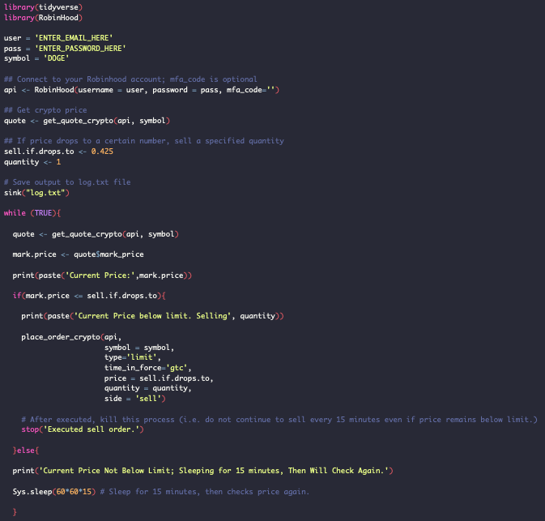

# Robinhood-Crypto-Auto-Stop-Loss
This script shows how to use the RobinHood API to place stop-loss sell orders for cryptocurrency, which is not a feature available through the App.

This script shows how to use the RobinHood API to place stop-loss sell orders for 
cryptocurrency, which is not a feature available through the App. An example use-case
would be, you want to go to bed, it's 10pm and your crypto has been declining all day. 
You bought in at 0.927, and if it hits 0.95 while you're asleep you want to sell a 
quantity of 10. I've also found that the API orders execute when the app is facing 
issues, but make no guarantee to this; Robinhood is a shady company. 

A reminder that RobinHood is funded by hedge funds, including Citadel LLC. Robinhood has 
continuously harmed retail investors and I encourage you to not use their platform. 
 
Robinhood does not buy the crypto you order from an exchange, instead hedging that it 
will decline in price and they can buy more should their internal pool need replenishing. 
Essentially you are buying an IOU for crypto through RH. You can not transfer your crypto 
out to a wallet, and I have doubts that any of the crypto they are selling actually exists. 
 
April 16, 2021 SEC Filing against RobinHood:
"[..] that Robinhood's customers received inferior execution prices compared to what they 
would have received from Robinhood's competitors, caused in large part by the high payment 
for order flow resulting in Robinhood's failure to satisfy its duty of best execution."

I make no guarantees and will hold no responsibility for any uses of this script. This is 
provided for educational purposes. The code is simple, though I suggest you review it and 
any functions used before relying on it at your own risk. 

